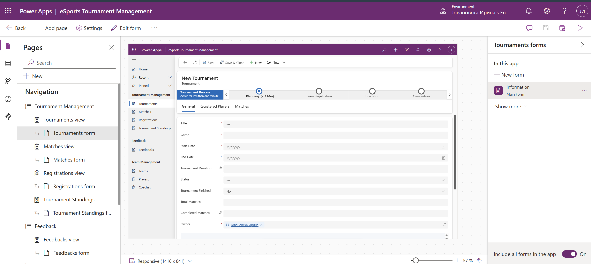
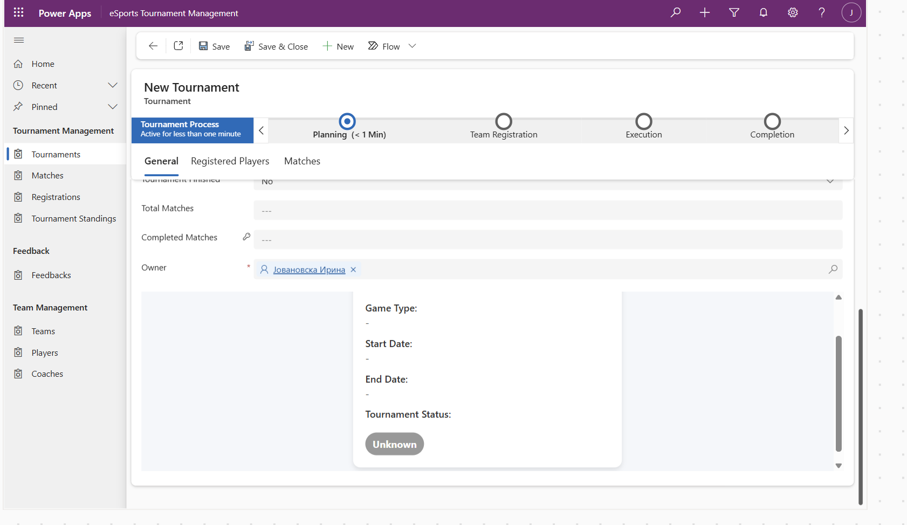

🎮 eSports Tournament Manager CRM

An end-to-end CRM solution for managing eSports tournaments, players, teams, matches, registrations, coaches and player feedback.

Built with **Microsoft Power Platform**, combining low-code configuration with custom JavaScript, C# Dataverse Plugins and Power Automate automation.

---

📌 Project Overview

The eSports Tournament Manager is a custom CRM application designed to support the management of eSports tournaments throughout their complete lifecycle.

The system provides functionality for:

- Player management
- Team management
- Tournament management
- Player registration
- Match scheduling and results
- Tournament standings
- Coach management
- Player feedback
- Automated notifications
- Role-based security
- Automated business logic

The solution was developed using Microsoft Dataverse as the central data platform and Power Apps as the application layer.

---

🛠️ Technologies

| Technology | Purpose |
|---|---|
| Microsoft Dataverse | Data model and relational data storage |
| Power Apps | Model-driven and Canvas applications |
| Power Automate | Workflow automation and notifications |
| JavaScript | Client-side form and command customization |
| C# | Dataverse Plugins and server-side business logic |
| HTML | Custom Web Resource |
| FakeXrmEasy | Plugin unit testing |
| Dataverse Solutions | Solution management and deployment |

---

🏗️ Solution Architecture

The solution follows a Microsoft Power Platform architecture:

```text
                    ┌─────────────────────────┐
                    │     Model-driven App    │
                    │                         │
                    │ Tournament Management   │
                    │ Players / Teams / Match │
                    └────────────┬────────────┘
                                 │
                                 ▼
                    ┌─────────────────────────┐
                    │     Microsoft Dataverse │
                    │                         │
                    │ Players                 │
                    │ Teams                   │
                    │ Tournaments             │
                    │ Matches                 │
                    │ Registrations            │
                    │ Feedback                │
                    │ Coaches                  │
                    └───────┬─────────┬───────┘
                            │         │
               ┌────────────┘         └─────────────┐
               ▼                                    ▼
      ┌──────────────────┐                 ┌──────────────────┐
      │ C# Dataverse     │                 │ Power Automate   │
      │ Plugins          │                 │ Flows            │
      │                  │                 │                  │
      │ Server-side      │                 │ Notifications    │
      │ business logic   │                 │ Automation       │
      └──────────────────┘                 └──────────────────┘
               │
               ▼
      ┌──────────────────┐
      │ Canvas App       │
      │                  │
      │ Player matches   │
      │ Tournament filter│
      │ Feedback         │
      └──────────────────┘
```
📊 Dataverse Data Model

The solution contains the following custom Dataverse tables:

Player,
Team,
Tournament,
Match,
Registration,
Feedback,
Coach

The tables are connected through Dataverse relationships to support tournament registration, team composition, match management and feedback.

Player

Stores player information including:

Name,
GamerTag,
Captain status,
Rank,
Preferred role,
Player number

A unique GamerTag alternate key is used to help maintain player uniqueness.

Team

Stores:

Team name,
Region,
Coach,
Founded date,
Team-related statistics

Tournament

Stores:

Tournament title,
Game,
Start date,
End date,
Tournament status

Match

Stores:

Tournament,
Team A,
Team B,
Scheduled time,
Winner

Registration

Connects players with tournaments and teams and stores registration information and status.

Feedback

Stores:

Player,
Tournament,
Rating,
Comments

Field-level security is used to protect player identity when feedback is submitted anonymously.

Coach

Stores coach information including:

Name,
Years of experience,
Certification

🎨 Model-driven App

The main application is a customized Power Apps Model-driven App.

The application includes:

Customized sitemap navigation,
Custom forms,
Custom views,
Subgrids,
Quick View forms,
Related records,
Tournament management,
Team management,
Player management,
Match management,
Registration management,
Feedback management

Tournament Form

The Tournament form provides access to:

Tournament information,
Registered players,
Related matches,
Tournament status,
Tournament information card

Team Form

The Team form provides:

Team information,
Team roster,
Related players

Coach information through a Quick View component

⚙️ Business Logic

Several business rules and processes were implemented to enforce application requirements.

Match Validation

The application validates Team A and Team B selections to prevent invalid match configurations.

Tournament Lifecycle

A Business Process Flow was implemented for the tournament lifecycle:

Planning
   ↓
Team Registration
   ↓
Execution
   ↓
Completion

Tournament status is updated throughout the lifecycle.

Tournament Completion

The application checks whether all related matches have a winner.

When all matches are completed:

A success notification is displayed
The tournament can be marked as completed

If matches are still missing winners:

A warning is displayed
The incomplete matches are identified

🔐 Security

The solution includes dedicated security roles:

Coach
Tournament Manager

Field-Level Security is also used for feedback functionality to protect player identity and support anonymous feedback.

💻 JavaScript & Command Bar Customization

JavaScript was used to extend standard Model-driven App functionality.

Lock Match

A custom command allows users to lock a match after it has been played.

The functionality:

Checks the current Match record
Sets the match to a locked state
Saves the record
Refreshes the form
Tournament Completion Validation

JavaScript is used to validate related matches and provide user feedback when a tournament is ready to be completed.

Team Filtering

Dynamic filtering is applied to Team A and Team B selections to prevent teams with the same coach from being selected against each other.

🔌 C# Dataverse Plugins

Custom server-side plugins were developed to implement business logic that should be enforced at the Dataverse level.

Match Result Plugin

When a match result is submitted, the plugin:

Updates tournament standings
Updates winner-related statistics
Tracks completed matches
Determines when the final match has been completed
Marks the tournament as completed when appropriate
Prevent Team Deletion Plugin

Prevents deletion of a Team when the team has registered players.

Delete Team
     │
     ▼
Has registered players?
   /        \
 Yes        No
  │          │
  ▼          ▼
Block      Allow
Delete     Delete
Player Number Generation

When a new Player record is created, the system automatically generates a Player Number following the required format:

P{IncrementalNumber}-{Initials}|{YYYY}

Example:

P00001-PN|2025
⚡ Power Automate

Power Automate was used to automate notifications and background business processes.

Match Participant Notification

When teams are matched for a round, automated notifications are sent to the affected teams.

Tournament Completion Notification

When a tournament is completed, an automated summary notification is generated.

Match Statistics

When Team A or Team B changes on a Match record, the affected team's match statistics are recalculated and updated.

Low Rating Feedback

When feedback with a low rating is submitted, an in-app notification is sent to the Tournament Manager.

📱 Embedded Canvas App

A Canvas App is embedded inside the Player form.

It provides players with a dedicated interface for:

Viewing upcoming matches
Viewing past matches
Filtering matches by Tournament
Submitting feedback for completed tournaments

The Canvas App provides a more focused user experience while remaining integrated with the Dataverse data model.

🖥️ Custom HTML Web Resource

A custom HTML Web Resource was created for the Tournament form.

The Tournament Information Card displays key information such as:

Tournament Title
Game Type
Start Date
End Date
Maximum Teams
Tournament Status

The component provides a more visual and user-friendly presentation of tournament information.

🧪 Testing

Unit tests were implemented using FakeXrmEasy for critical Dataverse Plugin logic.

Test scenarios include:

Match Result
Tournament standings are updated correctly
Final match completion is detected
Tournament completion is triggered when appropriate
Team Deletion
Team deletion is blocked when registered players exist
Team deletion is allowed when the team has no registered players

🚀 Deployment

The application components are organized within a Dataverse Solution.

The solution can be exported from the development environment for deployment to a production environment.

📸 Screenshots

Screenshots of the application and its main components will be added here.

Model-driven App

screenshots/Main App.png

Tournament Form




Match Form


Player Form & Embedded Canvas App


Tournament Information Card


🎯 Project Goals

This project demonstrates practical experience with:

Microsoft Dataverse
Power Apps development
Model-driven Apps
Canvas Apps
Power Automate
C# Dataverse Plugins
JavaScript form customization
Command Bar / Ribbon customization
Business Process Flows
Business Rules
Field-Level Security
Dataverse Solutions
Unit Testing with FakeXrmEasy
👩‍💻 Author

Irina Jovanovska

Microsoft Power Platform / Dynamics 365 Developer Portfolio Project
